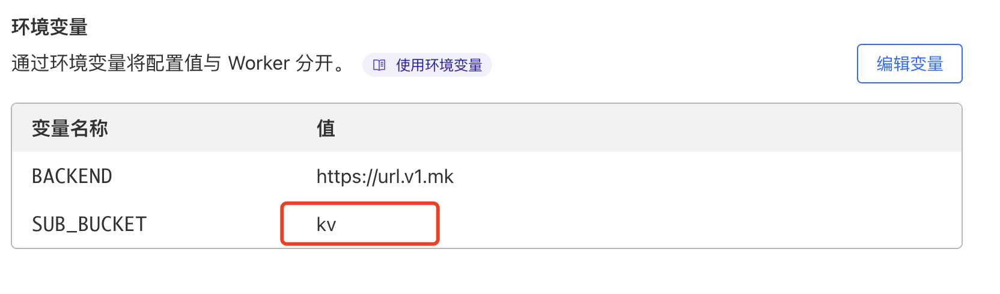
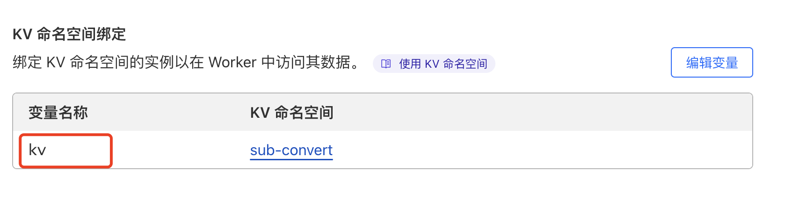

# subconverter-cloudflare

subconverter-cloudflare

  
  

## 演示网站

-   [https://sub-convert.visitor-worker.workers.dev/](https://sub-convert.visitor-worker.workers.dev/)  
-   [https://sub.zvz.cloudns.ch/](https://sub.zvz.cloudns.ch/)
-   [https://sub.looby.us.kg/](https://sub.looby.us.kg/)

## 环境变量

<table>
  <tr>
    <td>变量名</td>
    <td>说明</td>
    <td>是否必填</td>
    <td>变量值</td>
  </tr>
  <tr>
    <td>BACKEND</td>
    <td>后端转换地址</td>
    <td>否</td>
    <td>默认https://url.v1.mk</td>
  </tr>
  <tr>
    <td>SUB_BUCKET</td>
    <td>KV名</td>
    <td>是</td>
    <td></td>
  </tr>
  <tr>
    <td>LOCK_BACKEND</td>
    <td>是否禁用后端地址选择</td>
    <td>否</td>
    <td>默认true</td>
  </tr>
  <tr>
    <td>REMOTE_CONFIG</td>
    <td>自定义远端配置,多个换行</td>
    <td>否</td>
    <td>
        https://xxxxx1 
        https://xxxxx2
    </td>
  </tr>
</table>

### 请确保你的 SUB_BUCKET 的值和绑定的 kv 名称一致

-   如果只绑定 kv，那么 kv 的变量名称请固定为`SUB_BUCKET`,如果设置环境变量 SUB_BUCKET，那么 kv 的变量名称请设置为环境变量`SUB_BUCKET`的变量值，请参考下图

 

### 更新日志

-   2024-07-18
    -   支持 sing-box 规则
-   2024-08-02
    -   支持 hyhysteria2 订阅链接
-   2024-08-20
    -   支持 hy2 订阅链接

### 鸣谢

-   [https://github.com/bulianglin/psub](https://github.com/bulianglin/psub)
-   [https://github.com/ACL4SSR/ACL4SSRs](https://github.com/ACL4SSR/ACL4SSR)

